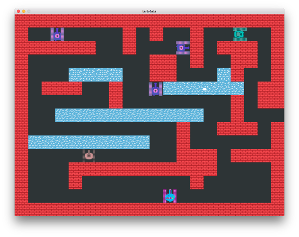

## tank4eta

A small BattleCity like game I am building for fun. It is written in Python.



### How to Run

**Option 1** - You can grab an already built binary from the GitHub's [release page](https://github.com/ironsmile/tank4eta/releases). But I am limited how many different targets I can support with builds.

**Option 2** - If your OS is not in the list you will have to run it from source. Luckily python is now ubiquitous and PyGame (with extended image support) is a breeze to install via pip. First, make sure you have Python3 and PyGame 1.9.* installed. The game can be started with `python app.py`. All assets you would need are included in the repo. In short, you have to run the following:

```
git clone https://github.com/ironsmile/tank4eta.git
cd tank4eta
pip install -r requirements.txt
python app.py
```

**Under OSX/MacOS**

OSX needs some special attention. Due to python3 not being a Framework build or something. I don't really understand what that means. But few extra steps should be taken in order to get a proper PyGame installation.

First, you need to get a python3 under [virtualenv](https://virtualenv.pypa.io/en/stable/). Then you need [homebrew](https://brew.sh/). With all of the tools under your belt we're ready to paste some commands!

We will need to build our own version of PyGame. Which requires some SDL stuff. Let's install them:

```
brew install sdl sdl_image sdl_mixer \
            sdl_ttf smpeg portmidi \
            libpng libjpeg mercurial
```

Then we should get ourselves the PyGame source and build it. I've used version 1.9.3 with success.

```
hg clone https://bitbucket.org/pygame/pygame
cd pygame
hg checkout 1.9.3
python setup.py build
python setup.py install
```

Great! You now have a functioning PyGame. One last step remaining! Due to the Frameworks stuff I don't understand the PyGame window would not work properly just yet. Luckily there is a workaround.

```
pip install venvdotapp
venvdotapp
```

And you are ready to go!

### Controls

The game supports GamePads (or joysticks in PyGame parlance). If you do not have any, then the keyboard controls are:

* Player 1: movement with `up`, `down`, `left`, `right` and shoot with `space`.
* Player 2: movement with `w`, `a`, `s`, `d` and shoot with `t`

Unfortunatelly as of `v1.0.0` they cannot be rebinded.

### Mods: Your Own Maps

Everyone can create maps for the game. A map is just a text file with a name ending in `.map`. So, here is an example map:

```
######################
#w  e          e    w#
#w                  w#
#wwwwww  w e  w www w#
#          ww w  ww  #
#    ~~~~  ww   ~w   #
#  www  w   ~~~~~~ w #
#       w e      w w #
#   ~~~~~~~~~~~      #
#sssssssssss w  www  #
#s~~~~~~~~~s w       #
#sssssssssss www www #
#    wwwwwwwwwww     #
#    w        w      #
#         w          #
#     p  fw  p       #
######################
```

The map is encompassed in a rectangle of the border characters - `#`. Every single character inside of this rectangle represents an object on the map. The game world is composed of squares and a character represents such a square. New lines should be in unix format, that is to say just the newline character - `\n`. Here is a breakdown of the meaning of all characters:

* `#` - border character, it will be ignored in the final map. It is only useful to define the boundaries of the map.
* `p` - spot on which a player tank can spawn **(required)**
* `e` - spot on which an enemy tank can spawn **(required)**
* `w` - brick wall
* `i` - ice
* `s` - sand
* `~` - water
* `f` - the UN flag
* ` ` _(space)_ - empty rectangle

Maps must be placed in `data/maps` directory and have a name like `my-new-level.map` so that the game would recognize and load them.

Sublime Text syntax file and theme colours for editing maps can be found in [this repo](etc/sublime-text).

### Credits

In creating this I've used the following open parts:

* The [PyGame engine](http://www.pygame.org/)
* [Ubuntu font](https://design.ubuntu.com/font/)
* [pygame-menu](https://github.com/ppizarror/pygame-menu) by Pablo Pizarro R.
* [Python Pathfinder](https://github.com/brean/python-pathfinding) by Andreas Bresser

All the professional sounds in this game are the result of long and meticulous work by me and my closest people. So I am thankful for all the help I've received in this department!
